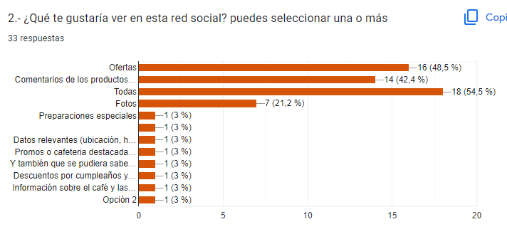
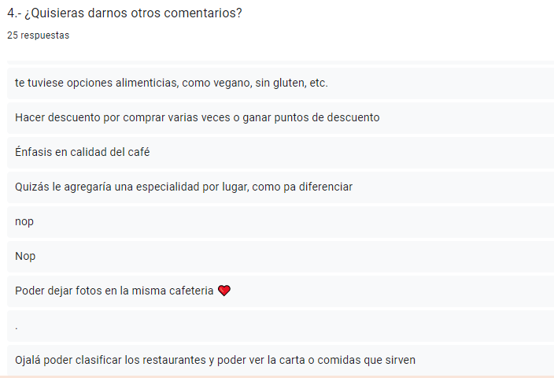
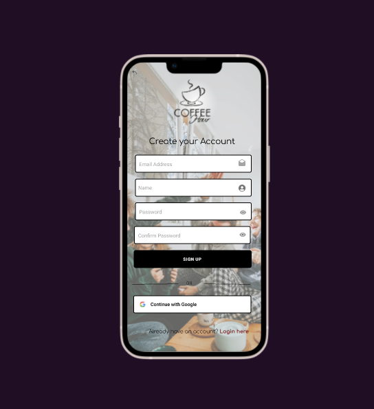
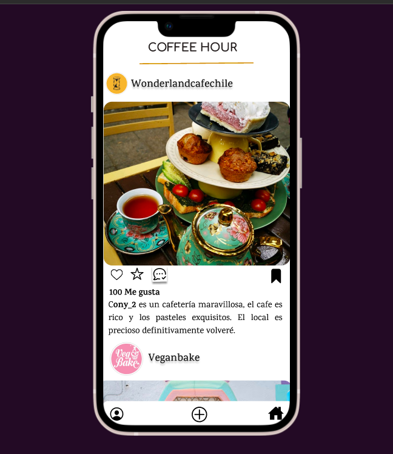

# Creando una Red Social

## Índice

* [1. Preámbulo](#1-preámbulo)
* [2. Resumen del proyecto](#2-resumen-del-proyecto)
* [3. Definición del Producto](#3-definición-del-producto)
* [4. A quién va dirigido](#4-a-quién-va-dirigido)
* [4.1. Historias de usuarios](#4.1-historias-de-usuario)
* [5. Prototipo de Alta](#5-prototipo-de-alta)

## 1. Preámbulo

El siguiente proyecto de desarrollo web, contempla el aprender y usar herramientas variadas en relación a la creación de una Red Social, enfocada el producto final que se le puede entregar a un usuario en particular. 

El siguiente repositorio contempla códigos y fundamentos de HTML, CSS y JavaScript. 

## 2. Resumen del proyecto

Este tercer proyecto de Social Network fue realizado por Daniela Cuarez, Gloria Villagrán y Tiare Rojas, de la generación DEV004 del bootcamp de Desarrollo Web de Laboratoria. 

Cómo trío de trabajo decidimos crear una red social enfocada en los amantes del café, brindando lo mejor que las cafeterías de la ciudad en la que te encuentras, tienen para ofrecer. Nuestra aplicación social se llama Coffee Hour. 

1- Primer prototipo de logo para nuestra red social 

2- Segundo prototipo de logo 

3- Prototipo final de logo 

## 3. Definición del producto

Nuestra red social permitirá a cualquier usuario crear una cuenta de acceso y la posibilidad de autentificación con Google para entrar a nuestra interfaz. Además el usuario podrá loguearse en ella, permitiendole crear, editar, borrar, comentar, dar likes/dislikes e incluso subir imágenes que puedan acompañar a sus posts y/o publicaciones de terceros. 

Además nuestro producto web debe cumplir con los siguientes objetivos:  
* Debe ser una Single-Page-Application que cumpla el propósito de darle fluidez a la navegación del usuario. 
* Aplicar los conceptos de responsividad en el desarrollo de las vistas (templates).
* Implementar un router para la navegación entre las diferentes vistas de la aplicación.
* Emplear un servicio externo para la persistencia de datos de la aplicación.
* Creación de pruebas unitarias para testeo de nuestro código asíncrono.

## 4. A quién va dirigido

Nuestra red social fue creada de acuerdo a Historias de Usuario recolectadas, las cuales fueron utilizadas para guiar nuestras semanas de trabajo y los procesos diversos; tales como que es lo que usuarios desean ver, hacer y realizar en nuestra aplicación web. 

Los principales usuarios de nuestro producto son amantes del café, que desean tomar y comer productos de gran variedad y calidad. Asistir a eventos, obtener descuentos e incluso poder calificar a cada cafetería a la que asistan. Es por ello que como equipo decidimos crear una aplicación móvil y web para que los usuarios interesados pudieran ser parte de una comunidad. 

Nuestro primer paso para establecer nuestrs organización fue realizar una encuesta por Google Forms formulando preguntas que nos ayudarían a construir nuestra red social teniendo en cuenta las opiniones de posibles usuarios. Lás siguientes imágenes representan las respuestas obtenidas: 

## 4.1 Historias de usuario

Luego de recopilar la información necesaria, organizamos toda la información recibida en 9 historias de usuarios, lo cual guío nuestro trabajo diario y semanal para ir cumpliendo objetivos específicos.  

**Historia 1**
* COMO USUARIO: Amante del café
* QUIERO: ver una página web de cafés donde loguearse o registrarme. 
* CRITERIOS DE ACEPTACIÓN: visualizar la pantalla de inicio, los botones de login y register. 
* DEFINICIÓN DE TERMINADO: debe ser responsive, botones distribuidos adecuadamente en la pantalla, imagen de alta resolución. 

**Historia 2**
* COMO USUARIO: Amante del café
* QUIERO: ver la página de registro
* PARA: poder crear mi cuenta en la aplicación coffee hour. 
* CRITERIOS DE ACEPTACIÓN: visualizar la página de registro, visualizar los campos de inscripción para crear su cuenta, visualizar botón de registro con cuenta gmail/google, visualizar botón de continue. 
* DEFINICIÓN DE TERMINADO: debe ser responsive, botones distribuidos adecuadamente en la pantalla, imagen de alta resolución. 

**Historia 3**
* COMO USUARIO: Amante del café
* QUIERO: ver la página de login 
* PARA: ingresar a mi cuenta en la página de coffee hour
* CRITERIOS DE ACEPTACIÓN: visualizar la página de login, visualizar los campos de inicio de sesión, visualizar botón de inicio con cuenta gmail/google, visualizar botón de sign up en caso que ya esté registrado.  
* DEFINICIÓN DE TERMINADO: debe ser responsive, botones distribuidos adecuadamente en la pantalla, imagen de alta resolución, que la visualización de log in sea amigable para el usuario, base de datos. 

**Historia 4**
* COMO USUARIO: Amante del café
* QUIERO: ingresar los datos de registro 
* PARA: poder registrarse en la aplicación
* CRITERIOS DE ACEPTACIÓN: visualizar los campos de registro, visualizar el botón google, poder acceder mediante mi cuenta gmail, y lograr registrarme en la aplicación. 
* DEFINICIÓN DE TERMINADO: responsive, desplegada por github pages, que reciban inputs de texto para el registro, que el botón sign up nos redirija al perfil del usuario nuevo, con el botón de google realice inscripción automática, la base de datos de firebase, test unitarios, que boton login here nos redirija a página de Login. 

**Historia 5**
* COMO USUARIO: Amante del café
* QUIERO: poder ingresar a mi cuenta
* PARA: ver mi perfil
* CRITERIOS DE ACEPTACIÓN: poder ingresar un email y contraseña, poder ingresar mediante botón gmail, el botón sign up me redirige a la página de registro, que botón continue permita ingresar al perfil del usuario, que al hacer clic en forgot password sea redirigido…… 
* DEFINICIÓN DE TERMINADO: responsive, desplegada por github pages, que el botón continue nos redirija al perfil del usuario, con el botón de google permite entrar al perfil del usuario, la base de datos de firebase, test unitarios.

**Historia 6** 
* COMO USUARIO: Amante del café
* QUIERO: poder crear un post
* PARA: mostrar y comentar la cafetería que me gusta 
* CRITERIOS DE ACEPTACIÓN: poder ver el botón para crear post, ver una casilla donde pueda escribir mi post, ver botón guardar mi post
* DEFINICIÓN DE TERMINADO: responsive, crear una base de datos de firestore, crear una colección para que se puedan leer los datos, maquetar la página de muro, crear botón agregar post, crear botón para guardar post, crear funcionalidad de usuarios y crear post, test unitarios.

**Historia 7**
* COMO USUARIO: Amante del café
* QUIERO: poder eliminar el post que realicé 
* PARA: poder subir el correcto 
* CRITERIOS DE ACEPTACIÓN: poder ver el botón para eliminar el post, ver el mensaje de confirmación para eliminar el post, ver que se haya eliminado mi post.
* DEFINICIÓN DE TERMINADO: responsive, agregar botón de eliminar con icono en el post, crear funcionalidad de eliminar post, test unitarios, crear mensajes de confirmación. 

**Historia 8:**
* COMO USUARIO: Amante del café
* QUIERO: poder editar mi post 
* PARA: tener la oportunidad de corregirlo si me equivoque
* CRITERIOS DE ACEPTACIÓN: poder ver el botón para editar el post, ver campos de título y descripción de post para poder editarlos, ver actualizado mi post. 
* DEFINICIÓN DE TERMINADO: responsive, agregar botón de editar con icono de post, crear funcionalidad de eliminar post, test unitarios, crear mensaje de confirmación. 

**Historia 9**
* COMO USUARIO: Amante del café
* QUIERO: poder visualizar mi perfil 
* PARA: subir imagenes
* CRITERIOS DE ACEPTACIÓN: poder ver mi foto, poder ver botones de favoritos, guardado y mapa para poder acceder, poder ver botones de home, editar perfil y signout, test unitarios. 
* DEFINICIÓN DE TERMINADO: responsive, crear espacio para agregar foto de perfil, crear botones de favoritos, guardados y mapas, cerrar barra con iconos home, editar perfil y signout, test unitarios. 

## 5 Prototipo de Alta

Este corresponde a un prototipo realizado en Figma. Como diseño inicial era así como  deseabamos implementar nuestra página versión móvil. 

**Pagina Home**

**Pagina Login**

**Pagina Register**

**Pagina Muro**
